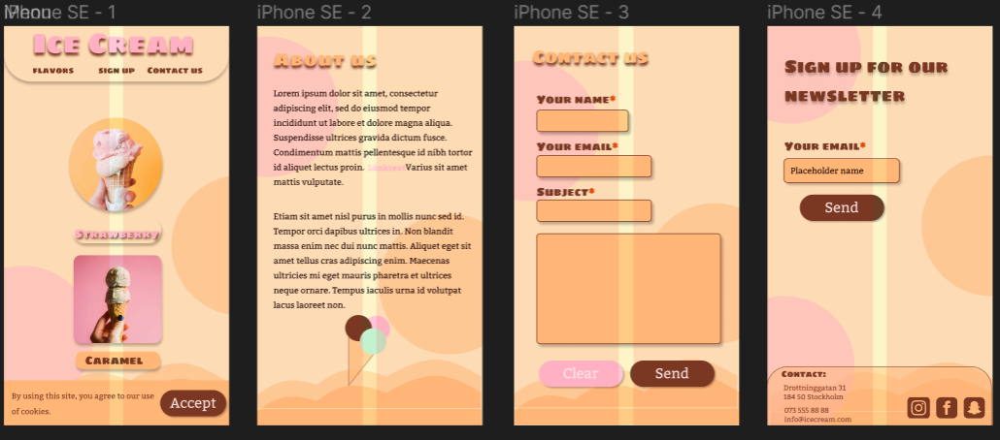
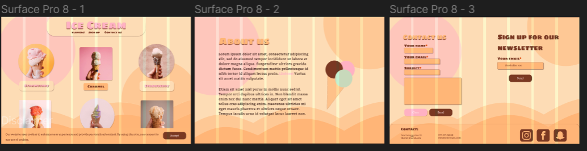
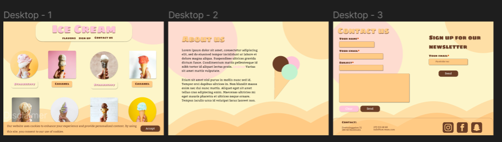

# ABOUT THE DESIGN

Välkommen till Glorys designprojekt! Nedan följer en översikt av våra designval och strategier som vi tänkt ska användas för att skapa den visuella identiteten för vår webbplats.

## Designelement:

### Färger:
Vi har valt en pastellfärgpalett för att ge webbplatsen en mjuk och inbjudande känsla som ska föra tankarna till glass och sommar. Färgerna används för att framhäva viktiga element och skapa en enhetlig upplevelse för besökarna.

### Typsnitt:
- **Rubriker:** Vi använder "Sigmar One" för rubriker för att ge en lekfull och markerad stil.
- **Brödtext:** För brödtext använder vi "Kadwa" för att ge en lättläst och elegant känsla.

### Knappar:
Vi har valt att använda knappar med rundade hörn för att skapa en mjukare och mer tilltalande visuell estetik. Detta bidrar till en mer inbjudande användarupplevelse.

### Meny:
Menyn består av en tydlig rubrik följt av navigationslänkar för att göra det enkelt för användarna att hitta det de söker.

### Bakgrund:
Bakgrunden på vår webbplats är en gul färg med pastelliga cirklar i rosa och orange, som kan ses som glasskulor. Cirklarna ska animeras så de sakta rör sig för att ge en dynamisk och levande känsla till webbapplikationen.

### Glassanimation:
Vi har implementerat en glassanimation där glasskulorna rör sig när användaren hovrar över glassen. Om användaren sen klickar på glassen hoppar glasskulorna upp en bit för att ge en interaktiv och rolig användarupplevelse.

### Hover- och klickeffekter:
I vår design har vi lagt till hover och klickeffekter på en del av designen. 
- **Produktbilderna:**  När användaren hovrar på glassen så förstoras bilden, den får en ram och användaren kan läsa om glassens ingredienser. 
- **Länkar och knappar:** Vid hovring och klick på länkar och knappar skiftar färgerna från olika nyanser av brunt, rosa och svart.
- **Meny:** Vid hovring över menyn samt vi klick på den ändras färgerna från mörkbrun till ljusbrun, till ljusrosa.

### Wireframes:
Mobile version

Tablet version

Desktop version
