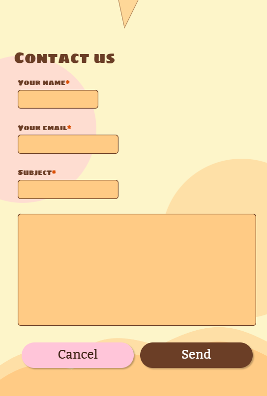

# Ice cream

### Link to repository

https://github.com/Medieinstitutet/fed23d-grafiska-verktyg-glory-1

### Livelink

https://medieinstitutet.github.io/fed23d-grafiska-verktyg-glory-1/

### Assigment technicalities
In our current web development course, we're diving into the world of graphics and design. This project is a team effort, where we've been exploring these concepts together. The assignment unfolded over two weeks: first, each group created a one-page web design using FIGMA. Then, we swapped designs with other groups and dove into coding the design we received in the second week. It's been an exciting journey, offering us insights into both the creative and technical sides of web development. Through this experience, we're gaining a deeper understanding of design principles and how they come to life in real projects.

## Design Authors
- [@RebeckaGothlin](https://github.com/RebeckaGothlin)
- [@helenaskagerlid](https://github.com/helenaskagerlid)
- [@Ogen1998](https://github.com/Ogen1998)
- [@Carinalak](https://github.com/Carinalak)

## Code Authors
- [@tsemitris](https://github.com/tsemitris)
- [@Annika-Nyholm](https://github.com/Annika-Nyholm)
- [@olandstorm](https://github.com/olandstorm)
- [@alahojat](https://www.github.com/alahojat)

# About the design

Here's an overview of the design choices and strategies intended to shape the visual identity of the website. A pastel color palette has been chosen to give the website a soft and inviting vibe, reminiscent of ice cream and summer. These colors are used to highlight important elements and maintain a cohesive look and feel. For typography, "Sigmar One" is used for headlines, adding a playful and eye-catching touch. "Kadwa" is the choice for body text, offering a balance of readability and elegance.

Buttons feature rounded corners, contributing to a softer and more appealing aesthetic. This enhances the overall user experience, making it more welcoming. The menu is straightforward, with a clear header followed by navigation links, making it easy for users to find what they're looking for. The background of the website is a sunny yellow, adorned with pastel circles resembling scoops of ice cream. These circles move gently, adding a dynamic and lively feel. An interactive ice cream animation adds a fun element. Hovering over the ice cream causes the scoops to move, while clicking makes them bounce slightly. Various hover and click effects have been incorporated into the design:
- Product Images: Hovering enlarges the ice cream images, allowing users to view ingredient details.
- Links and Buttons: Hovering and clicking trigger color shifts, adding visual interest.
- Menu: Hovering and clicking cause color changes, enhancing usability.
- These effects add depth and interactivity to the user experience.

## Project built with


### Start project
```
pnpm install
```

### devDependencies
```
eslint
prettier
vite
```

### Dependencies
```
gsap
sass
```

## Initial Wireframes from the design team
Mobile version


Tablet version


Desktop version


## Final result

### Mobile





| Tablet    | Desktop |
| -------- | ------- |
|   |     |


## Lessons learned
- This project has taught us the importance of consistency and coherency across the full design process as well as using a mobile first approach when designing, and taking in to account a smooth and doable transition from mobile, to tablet, to desktop.
- We have thoroughly learnt the importance of accessibility, especially implementation of all principles to ensure that all users have access to all contect on all pages. It has been interesting to apply and modify code according to a11y based off of someone else's design.  
- Furthermore we have understood how important it is to provide thorough and detailed handovers, it has become extra apparent when receiving a design, how difficult and timeconsuming it is to make our own estimates instead of being provided with exact details.
- As always, communication is key. Not only between the devs and design-team but within the group of developers working on the project. 

## Adaptations of design

- Secondary button: as the initial colours of the button didn't pass according to a11y we had to modify the colours yet still adhere and match to the design palette. We therefore chose stronger variations of pink colours (for default, hover and clicked state) as background colours as well as a dark brown as the button text against all pink backgrounds. 

- Links: the initial default state of links had very low readability and also required modification, which resultet in colourchanges in the different states. 

- Screens: as hover states do not apply to mobile and tablet screens, which usually require touch, we also had to create click states for mobile and tablet.

- Tablet width: in the initial Figma design we discovered that the the width of tablet and desktop were the same, and therefore we received a secondary tablet design with the width of 920px instead from the design team, hence the difference between tablet wireframe vs. final tablet result.

- Header links: increase the sizing of links in the header of a minimum of 35px for accessibility.


